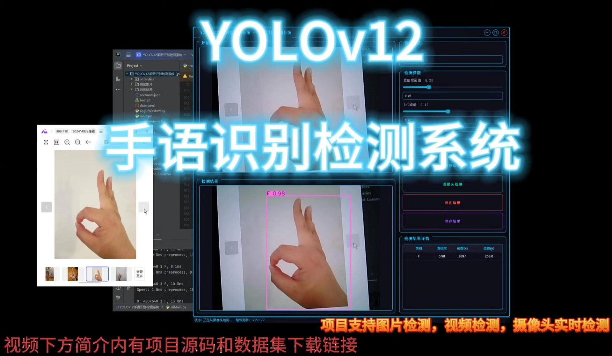
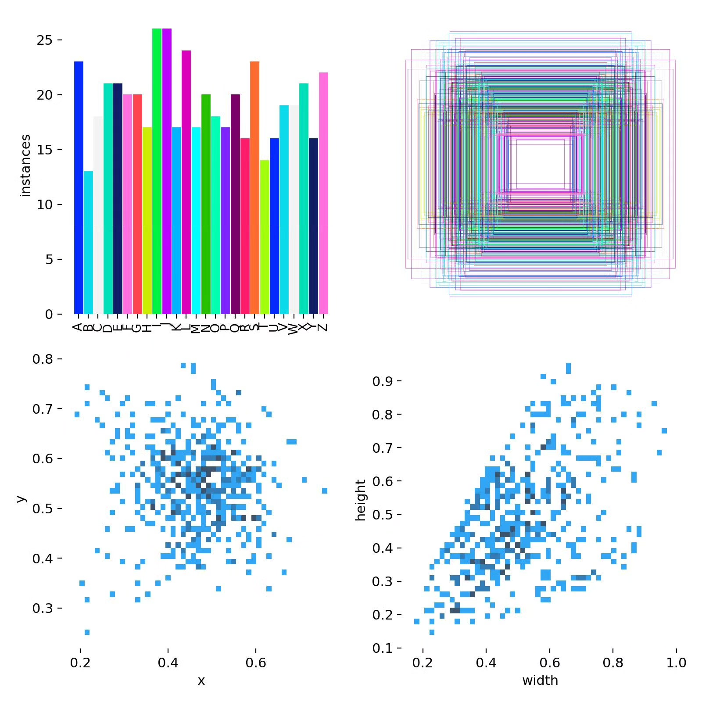
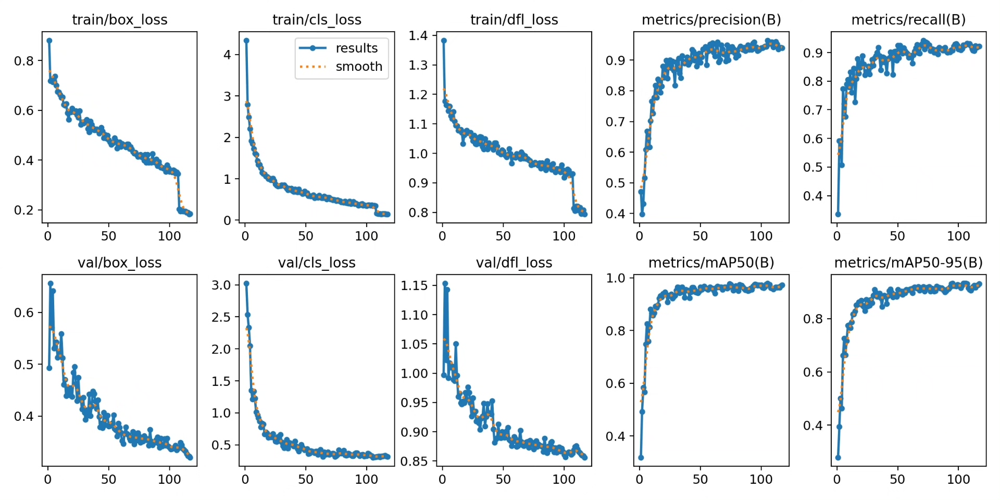
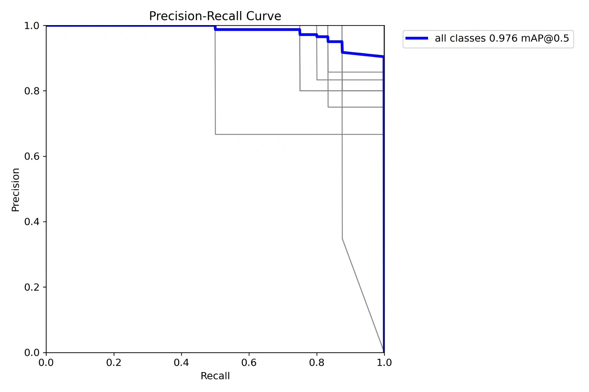
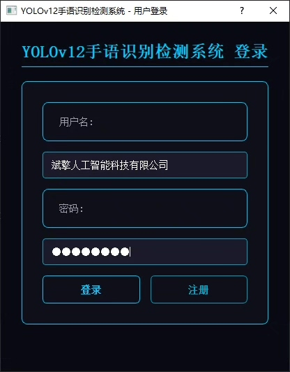
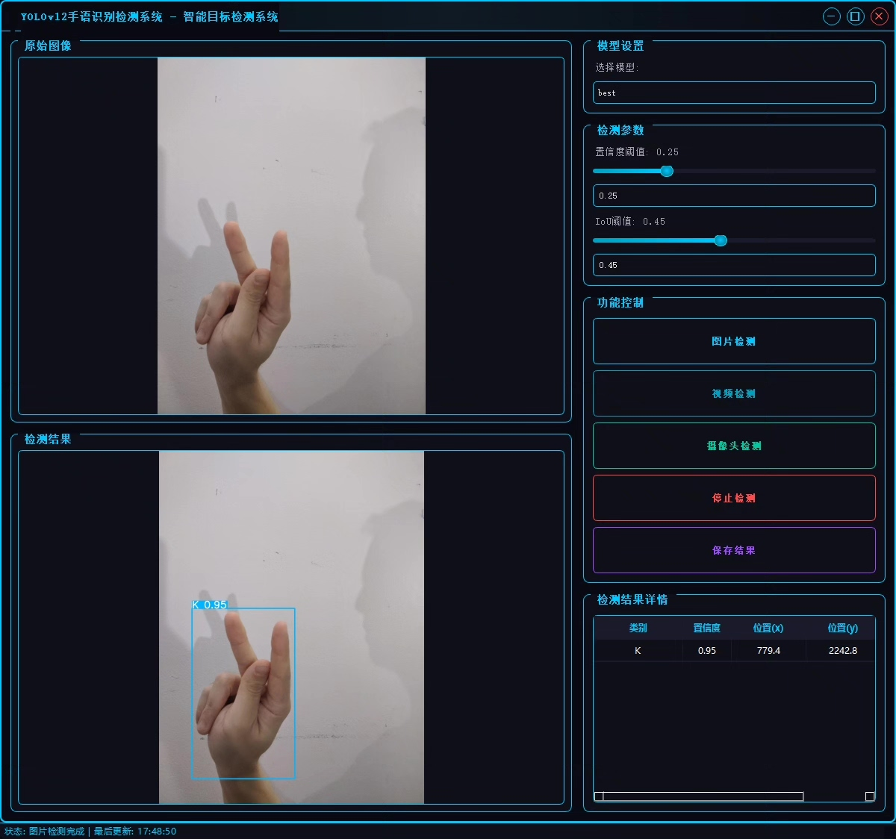
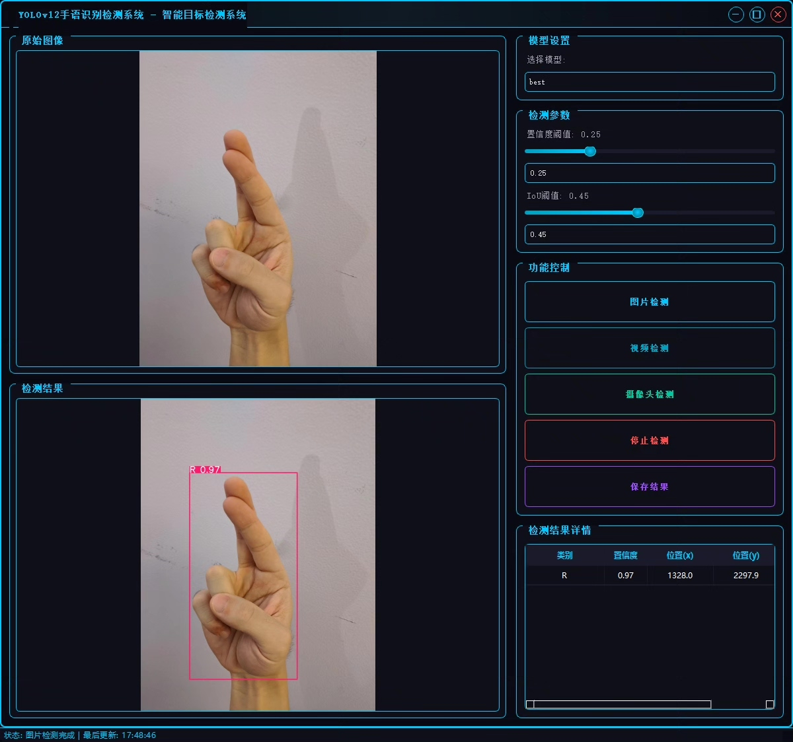

# YOLOv12 Sign Language Recognition System

## Body

YOLOv12 Hand Gesture Recognition System
YOLOv12 Hand Gesture Recognition Detection System

nc: 26
names: ['A', 'B', 'C', 'D', 'E', 'F', 'G', 'H', 'I', 'J', 'K', 'L', 'M', 'N', 'O', 'P', 'Q', 'R', 'S', 'T', 'U', 'V', 'W', 'X', 'Y', 'Z'],
dataset size: training set 504, validation set 144, test set 72.
✅ User Login and Registration: Supports password detection and security verification.

✅ Three Detection Modes: Based on the YOLOv11 model, supports image, video, and real-time camera detection, with precise recognition of targets.

✅ Dual-Screen Contrast: Display the original scene and detection results on the same screen.

✅ Data Visualization: Real-time table displaying the category, confidence, and coordinates of detected targets.

✅ Intelligent Parameter Tuning: Provides a confidence slide bar to dynamically optimize detection accuracy, adapting to different scene requirements.

✅ Sci-Fi Interactive Interface: Dark theme combined with dynamic light effects, reducing visual fatigue and improving operational experience.

## Images

## Payment

Here is a pay link on Stripe ( https://buy.stripe.com/3cs8yP7sY87d0vu9AB ). Please contact me lonlonago@foxmail.com after funding $89, and I will send you a complete data files , thank you!

